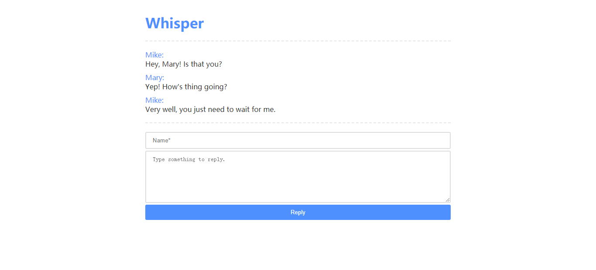

<h1 align="center">Whisper Beta</h1>

Serverless · Secret · Safe

## 这是什么？

Whisper，顾名思义，意思是“悄悄话”。这个超简单的程序能让你创建一个对话（Dialog），并且和你的朋友进行无法被监视的对话。
这听起来是一个正常聊天软件都能做到的事，但是 whisper 并不会储存任何用户数据，甚至你的对话内容都不会被储存在服务器上，这是个完全静态的聊天程序。  
当你输入你的名字和第一句对话内容（Whisper）时，一个对话就被创建了，稍等片刻（其实就不到一秒），程序会返回给你一个被缩短
了的链接（通过 t.cn），你让你的朋友访问这个链接，他就可以看到你输入的内容和另一个输入框，当他留下名字和内容并点击回复按钮（Reply），他也会得到一个链接，
你访问对方得到的链接就可以看到他的内容，并且他的内容排在你的内容之后，就像聊天记录一样。

## 它如何工作？

听起来这很神奇，但它的原理十分简单。当用户点击按钮创建对话时，程序会根据用户输入的名字和内容生成一段 json 数组，并通过 base64 进行加密，
将这段密文加入到地址栏参数中（Url Query），当用户访问带有指定参数（`?t`）的链接时，程序就会解密这段 base64 并根据返回的 json 输出聊天记录。  
没错，你所有的对话内容都储存在这个链接中，任何人都无法直接监控你的聊天内容。

## 它能做什么？

你可以使用 Whisper 来和你的朋友交流一些~~敏感的~~话题，并且不留任何痕迹，绝对不会被监控，你只需要访问最新的一个链接就能够再次查看你们的聊天记录，但是他可能不太适合进行太长的对话；你也可以在 Whisper 内写一些内容，供他人在线查看，这样就不会被一些平台限制字数了，因为结果就只有一个长度短小的链接。

还有其他的用法，只要你能想到。

## 如何使用？

访问 Whisper 演示站：https://bigcoke233.github.io/whisper  
输入你的 whisper 并创建对话，发给你的朋友，就可以进行无痕迹的对话了。尽管这不太方便，但它可能会在某些地方派上用场。

如果你想要自己搭建，Whisper 是纯静态的，你可以直接 fork 到你的仓库并打开 GitHub Pages；或者下载/ Clone 之后上传到你的服务器。之后访问域名即可。

---

## 已知 Bug

- ~~回复 Whisper 时不返回短链接而是备用的完整链接~~（已修复）
- 响应式设计的问题

## 开发计划

- [ ] 允许在 Whisper 和 Reply 中添加图片
- [ ] 支持简单的主题功能（动态引入不同的 css）
- [ ] Whisper/Reply 后自动跳转，并显示缩短后的链接
- [ ] 允许使用表情（不优先考虑）

---

Copyright &copy; 2020 Eltrac Koalar(BigCoke233), released under MIT License.
